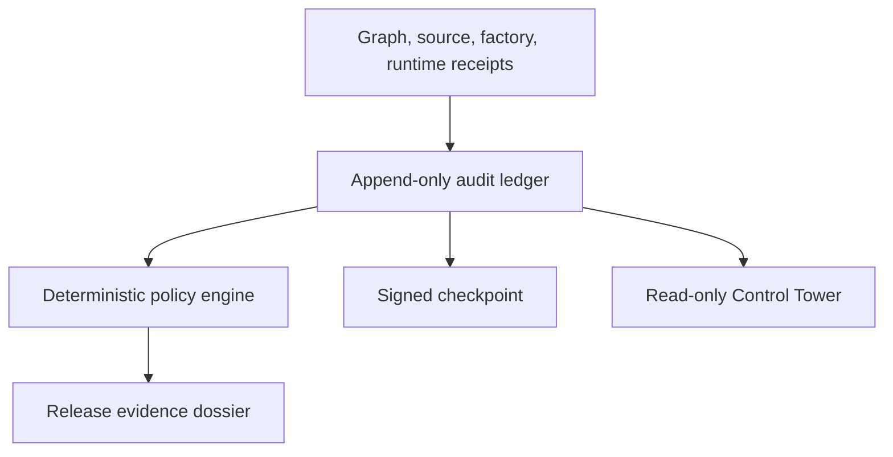

# LIGHTYEAR audit ledger and Evidence Control Tower

The audit plane makes factory activity auditable by construction. A deterministic control plane converts
existing graph, source-evidence, factory, and runtime receipts into one hash-chained event ledger.
The browser dashboard is a read-only projection of that ledger; it is never the source of truth.

The demo answers five governance questions:

1. **Who** performed or approved an action?
2. **What** changed, ran, passed, failed, or was blocked?
3. **Which evidence** supports the claim, and what is its SHA-256 identity?
4. **Which policy** made a release decision, and why?
5. **Can tampering, deletion, reordering, or stale projections be detected?**

## Architecture



The event ledger is authoritative. Policy decisions, statistics, dossiers, and browser views are
rebuildable projections. Each event includes a sequence, previous-event hash, content hash, actor,
subject, evidence references, visibility, and timestamp. The snapshot binds the chain to the exact
knowledge-graph identity.

## Included artifacts

- `audit.snapshot.json.gz`: canonical deterministic audit snapshot;
- `dossiers/carddemo-intcalc-v0.12-demo.json`: current machine-readable release evidence dossier;
- `dossiers/carddemo-intcalc-v0.12-demo.md`: current human-readable dossier;
- `policies/promotion.json`: versioned policy set;
- `examples/exception.example.json`: governed, expiring human exception example;
- `schema/`: JSON Schemas for events, snapshots, decisions, exceptions, policies, and dossiers.

The v0.12 canonical demo contains 15 events: graph and source-evidence publication, work-order
registration, normalized hardened-execution evidence, three distinct runtime captures, seven supporting
policy decisions, and one release-promotion decision. Promotion is intentionally **blocked**
because neither independently observed z/OS equivalence nor live container-enforcement evidence
exists yet.

A live Docker probe alone remains blocked. A passed signed factory-run receipt is accepted as a
different evidence class and clears only the hardened-execution gate. Generate that projection with
`./hardened-execution.sh admitted-run docker`; real z/OS equivalence remains independently blocked.

## Commands

Build canonical artifacts:

```bash
./audit-control-tower.sh build
```

Verify chain integrity, graph binding, hashes, projections, policy decisions, checkpoint, and
deterministic dossier output:

```bash
./audit-control-tower.sh verify
```

Inspect the trust posture or event stream:

```bash
PYTHONPATH=src python3 -m lightyear_audit inspect
PYTHONPATH=src python3 -m lightyear_audit inspect --events --audience auditor
PYTHONPATH=src python3 -m lightyear_audit inspect \
  --decision decision:release:carddemo-intcalc:v0.12-demo:promotion
```

Start the graph explorer and open the **Audit** tab:

```bash
./graph-explorer.sh
```

On Windows, use `audit-control-tower.ps1` and `graph-explorer.ps1`.

## Policy authority

Agents can plan, build, and explain, but they do not decide acceptance. Only the deterministic
policy engine and explicitly authorized human approvers can create policy outcomes. The contracts
reject policy decisions attributed to planner or builder roles.

`runtime.development_readiness` may be overridden by an expiring, human-approved exception with a
named owner, justification, and compensating controls. `runtime.mainframe_equivalence`,
`execution.hardened_readiness`, and `release.promotion` are deliberately non-overridable in this
release. No exception can manufacture mainframe or operating-system enforcement evidence.

## Checkpoint signing

The committed snapshot is unsigned so every developer can reproduce it byte-for-byte. Live
environments should supply a signing secret through the process environment:

```bash
export LIGHTYEAR_AUDIT_SIGNING_KEY="managed-outside-the-repository"
./audit-control-tower.sh build
```

The key is never serialized. Validation with the wrong key fails. HMAC proves possession of a
shared secret; production deployments should replace or complement it with a managed asymmetric
signing service, hardware-backed keys, signer identity, rotation, transparency anchoring, and
immutable external retention.

## Security and privacy boundaries

- Event details reject credential-, token-, cookie-, authorization-, secret-, password-, and
  private-key-shaped fields.
- `auditor_private` events are excluded from implementer views.
- The API is read-only and serves only the validated local snapshot.
- Browser content is rendered as text rather than trusted HTML.
- Optimistic head checks prevent two local writers from silently extending the same JSONL head.

This demo does not yet provide enterprise identity, multi-party approval, WORM storage, a remote
timestamp authority, key custody, legal retention schedules, or cross-region durability. Those are
deployment controls around the portable ledger contract, not reasons to put mutable dashboard
state in front of it.

## Failure behavior

Validation fails closed when an event is changed, deleted, reordered, duplicated, assigned the
wrong sequence, detached from its predecessor, projected incorrectly, bound to a different graph,
or covered by an invalid checkpoint signature. A blocked release remains useful output: it states
exactly which evidence gap must be closed instead of converting missing proof into false confidence.
