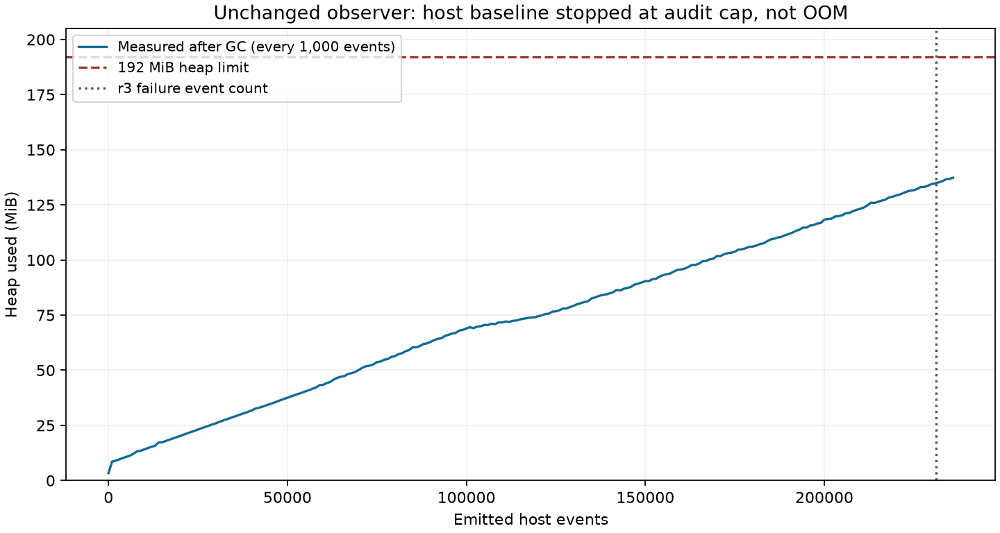

# B06 memory measurement: redesign gate not met

The requested host baseline did **not** reproduce the native OOM, and its
after-GC heap curve does **not** reach 192 MiB at r3 event 231,158. Work stops
at the attachment's measurement gate. The production observer, native adapter,
limits, serialization and unconditional October 11 engineering hold are unchanged.
This is a measurement milestone, not a completed memory redesign or a native pass.

## Experiment and result

The existing observer Java source was compiled unchanged from main at
`f5c124f8e7eb6cae6b5413128a02ddce45905a36` (SHA-256
`6945d3ad0a98429010a54f685061d836dfccee26eec6903a1e790012c4adeeae`).
The host used Amazon Corretto 21.0.10_7, a public synthetic target and an explicit
observer `-Xmx192m`. A separate reflection harness delegates capture, matching,
serialization and audit to production methods. It samples MemoryMXBean after
requested GC every 1,000 emitted events and runs `jcmd GC.class_histogram` on
each new sampled peak. The target uses three workers, thirty 100-class paths,
fresh hidden definitions, method-handle adaptation and LambdaMetafactory calls.
All five compiled observer hashes and output hashes are in the
[measurement record](b06-memory-baseline-r1.json).

| Measurement | Observed |
| --- | ---: |
| Elapsed host execution | 375.297 seconds |
| Emitted events | 236,030 |
| Generation entries | 13,906 |
| Distinct stack class objects at last sample | 3,061 |
| Deliberately suppressed returns | 63 (0.453% of generation entries) |
| Peak sampled heap after GC | 143,979,208 bytes / 137.31 MiB |
| Pending / completed / definitions at last sample | 65 / 1,191 / 9,095 |
| Termination | Existing structural-audit byte bound; observer exit 1 |
| OOM / full workload completion | No / no |

The audit cap was not raised. The runner terminated only its owned synthetic
target after the observer refused. There were no Docker, native application,
model, Tower, signing or machine-configuration operations. Plotting dependencies
were installed only under the isolated worktree's ignored `work` directory.



The [curve CSV](b06-memory-baseline-r1.csv) contains every recorded sample.
Ordinary least-squares fits over starts at events 1,000, 50,000, 100,000, 150,000
and 200,000 all end at 236,000. At event 231,158 they give **133.82–135.04 MiB**,
well below 192 MiB. This is an interpolation within the observed host range,
not a forecast of native safety. Slopes remain positive (546–581 bytes/event
after the 50,000-event warm-up choice); the existing design is not flat or
proven bounded. No after-fix curve is claimed.

The peak histogram's three largest live class totals are:

| Class | Instances | Shallow bytes |
| --- | ---: | ---: |
| `byte[]` | 507,007 | 43,504,384 |
| `LinkedHashMap.Entry` | 563,845 | 22,553,800 |
| `Object[]` | 194,458 | 20,353,912 |

These are **shallow live object totals**, not dominator retained sizes or proof
that a specific observer map owns all those bytes. Sampling includes harness
and JDI memory; repeated forced GC/histograms change timing and do not measure
short-lived serialization peaks. No heap dump was produced because no OOM occurred.

## Fidelity limits and why this does not settle the cause

All 3,000 public fixture classes occurred on stacks. The observed generation
depth median was 122, p99 125 and maximum **131**, one frame beyond the requested
100–130 range; startup entries were shallower. This is not full depth acceptance.
The workload also hit the audit cap before completing all 4,200 requested worker
iterations. Neither limitation is hidden by calling the run a pass.

The workload exercises real generation and payload capture, but is not the
application's workload. For example, native r3 definition-input bytes had
median 1,140 and maximum 262,269; the host had median 897 and maximum 10,173.
Native class-data graph median was 110 nodes versus host median 1. LambdaForm
graph maxima were similar (356 native / 357 host), but their distributions and
frequency differed. Native entry records include the broker envelope, so their
line lengths are not directly equal to raw host records. The native maximum
depth was 213. Payload tails, object lifetimes and transient allocation remain
unexplained; a negative synthetic result does not prove memory growth innocent
or prove another root cause.

Fault injection drops selected outermost ARETURN breakpoint dispatches before
an exit request exists. It leaves pending entries resident without editing
production state. This is deliberate return loss, not a reproduction of r3's
missing-entry delivery. The harness uses r3's diagnostic policy, supplies its
own JDI event loop and would label a VM-death endpoint as host-only even with
open entries. It never grants complete provenance or native admission.

## Authenticated r3 supplement

The [metadata-only supplement](b06-unmatched-r3-memory-supplement.json) was
extracted read-only from the preserved stream after verifying both signed
incomplete census/failure envelopes, every event seal/chain, the stream hash,
event count, final seal and matching plan/lane bindings. This is two signature
checks for this supplement, not a new claim of redoing the previous whole-run audit.

- 231,158 total records: 206,365 observer-audit, 12,396 generation-entry,
  12,389 generation-return, two frame-definition, five accepted unmatched-return
  and one ready record. No class-definition-v2 record was emitted before failure.
- Last audit index 206,365, event set 41,275, position 0: breakpoint in
  `MethodHandles$Lookup$ClassDefiner.defineClass(ZLjava/lang/Object;)Ljava/lang/Class;`,
  BCI 0, thread 69,950, depth 110.
- Accepted unmatched sequences: **230866, 230910, 230949, 230994, 231011**.
- Stream SHA-256 `14f354d75cfcc91beaf8ebc09cc7068a828e48c936ec3309d4982a390d53ddfd`.

This corrects the earlier incomplete understanding of how many unmatched
returns preceded the OOM. R3 progressed beyond earlier 24,827/24,870-event
failures, but remains a failed diagnostic with zero credit. Existing times,
exception stack, report/partial-audit hashes and verified cleanup are preserved
in the [terminal milestone](b06-unmatched-r3-terminal-milestone.md). No historical
record, archive or frozen file was rewritten. Raw captures and histograms stay local.

## Delivered tooling and validation

`tools.b06_host_probe.stress --native-volume-memory` runs the opt-in measurement.
`tools.b06_host_probe.memory_report` verifies local output hashes and produces
aggregate sizes, fit sensitivity and an optional matplotlib plot.
`tools.b06_host_probe.stream_supplement` authenticates the incomplete signed
stream and exports only structural metadata/counts/hashes.

The review-291-302 heading is repaired. The changed-file LF guard now checks
strict UTF-8 round trips for Markdown and rejects known double-encoding markers;
the required CI lint path calls that guard. Linux host CI includes the new
metadata/measurement tests and now selects on changes to the stress fixture.

Local validation ran 54 focused tests in 36.118 seconds: 53 passed, with one
documented Windows `ProcessHandle.Info` metadata skip. Real host JDI tests were
enabled with the pinned Corretto path. This includes the new measurement and
chain-tamper tests plus existing captured-refusal, startup, bulk-read, observer
audit, unmatched-return, engineering-hold and CI-gate tests. Linux final-head CI
must still complete before any merge; this local result does not substitute for it.

Run the baseline manually in a fresh, ignored output directory (host-only,
not part of ordinary CI):

```text
python -B -m tools.b06_host_probe.stress --native-volume-memory --jdk <explicit-jdk> --out <fresh-local-directory> --iterations 1400 --observer-heap-mib 192 --timeout 10800
python -B -m tools.b06_host_probe.memory_report --folder <completed-local-directory> --out <new-summary.json> --plot <new-curve.png>
```

The raw reflection-harness stream is public synthetic data but is not a signed
broker archive. Do not feed it to an admission gate. Existing archive formats
are unchanged, so no new writer compatibility claim is needed or made.

## Approval remains blocked

No bounded production redesign, resource guard, new lifecycle diagnostics,
three-unmatched cap, heap/container sizing proposal or after-fix proof was made:
the explicit prerequisite failed. A larger guessed heap is not proposed from
this unrepresentative, incomplete baseline. No amended executable engineering
approval request is ready. The planned strict-then-diagnostic sequence remains
a proposal behind the hold. The separate engineering signing key and launch
fingerprint check are deferred follow-up prerequisites before any native attempt;
no key was created or read.

The next decision is whether to authorize a revised host workload with native
payload tails and corrected depth, or evaluate the observer alternatives. This
batch does not silently repeat experiments until one fails as desired. No native
attempt is proposed for October 11. Howard's renewed approval, final-head green
CI and exact-commit merge approval remain required. Operator review only;
not independent attestation.
