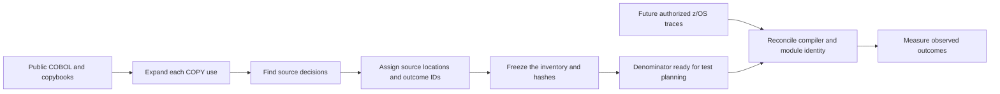
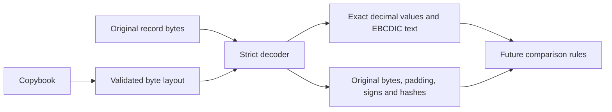

# Mainframe preparation: decisions, records and a rehearsed handoff

We can prepare the measurement and data-reading machinery before a mainframe is available. This kit answers three questions: **what decisions exist in the public source, can we read the record formats accurately, and can the batch lanes collect the right retained outputs?**

The current results are:

| Work completed | Result | What it establishes |
| --- | ---: | --- |
| Public CardDemo COBOL inventory | 44 programs, 1,423 decisions, 3,605 source outcome slots | A reproducible source-level denominator for test planning |
| Public EBCDIC fixture decoding | 501 records across five datasets | Local decoding succeeds and every original byte is retained |
| Batch invocation rehearsal | INTCALC and POSTTRAN, both lanes | Explicit job/step/procedure/DD selection and record decoding work against the mock |
| Native runtime coverage | Unobserved | No z/OS execution or equivalence claim yet |

## A claim that can be published now

> At public CardDemo revision `59cc6c2fd7ebd7ef7925cad552a01a4b8b6e4d5e`, LIGHTYEAR inventories 1,423 source-level decisions with 3,605 outcome slots across 44 COBOL programs, including expanded procedural copybooks. Each decision has a source location and stable identifier, and the inventory records the source hashes. This is a static test-planning denominator. Native execution coverage has not yet been measured, and completeness against compiled mainframe behavior is not claimed.

[Read the per-program report](carddemo/report.md), [inspect the full inventory](carddemo/inventory.json), or [inspect the unobserved coverage baseline](carddemo/coverage-baseline.json).

The 44 programs include CardDemo's base application and its DB2, IMS and MQ variants. The inventory counts each copybook inclusion separately: **119 decisions come from procedural copybook expansions**. Missing compiler libraries remain visible: **62 COPY references to eight CICS/MQ library names**. The supplied public COBOL programs were all scanned; those external libraries were not invented or substituted.

## What a decision means

An `IF` has two possible outcomes: true and false. The false outcome exists even when there is no written `ELSE`. An `EVALUATE` selects a `WHEN` alternative. A loop decides whether to continue or exit. A file operation with an `INVALID KEY` handler distinguishes the condition from normal completion.



The counting profile is `cobol-source-outcomes-v1`:

- Each `IF` contributes true and false, including compound conditions as one decision.
- Each `EVALUATE WHEN` contributes one selection alternative; consecutive WHEN alternatives sharing a body remain separate. A missing OTHER contributes an implicit no-match slot.
- Each PERFORM UNTIL test contributes continue/exit. PERFORM TIMES contributes repeat/done. Unconditional loops are boundaries, not invented binary decisions.
- SEARCH contributes its declared WHEN alternatives and exhaustion. Internal search comparisons are outside this source profile.
- Explicit condition handlers contribute condition/normal once per operation, even when both positive and negative phrases are written.
- Computed GO contributes each destination and out-of-range fallthrough. CardDemo's altered GO site includes its initial destination and the statically named ALTER destinations.

Source positions use fixed format, columns 7–72, with eight-column tab stops. Comments, quoted text and embedded EXEC bodies do not manufacture COBOL decisions. Literal continuations and the pseudo-text COPY REPLACING form used by this estate are supported. Other source formats, preprocessing directives, unsupported replacement forms and broken selection structures are reported as gaps.

**This is not path coverage, MC/DC, a full COBOL compiler, or proof that every counted alternative is reachable.** Compiler-generated checks, subsystem internals and dynamic call behavior require additional evidence. The JSON lists 240 CICS blocks, 26 DLI blocks, 20 SQL blocks and 63 external call sites as boundaries. These counts describe syntax, not executed interactions.

For the interest program alone, `CBACT04C`, the denominator is **47 source decisions / 94 outcome slots**. A campaign exercising only that program must not present its hits as coverage of all 44 programs. Reachability exclusions and compiler differences must be reviewed before publishing a runtime percentage.

## Reading the records without changing their meaning

A copybook is a record's layout: which bytes contain an account number, balance, text or padding. The compiler produces offsets and lengths from that layout. The decoder then reads the original fixed-length bytes.



Supported layouts include one level-01 record, nested groups, fixed OCCURS, PIC X/A/9/S9/V, DISPLAY/zoned decimals, COMP-3, and leading/trailing separate signs. Supported EBCDIC code pages are explicitly selected: `cp037`, `cp500` or `cp1140`. The public fixture check uses `cp037`.

Amounts are exact decimal strings with their original digit string and scale. Numeric identifiers keep their leading-zero digit string as well as their numeric value. Original field bytes, record bytes, filler and text padding are retained. Negative zero is preserved. No decimal tolerance, trimming, ignored filler or business equivalence rule is applied.

The default `preferred` decoding policy accepts C/D/F for signed packed or overpunched data and F for unsigned packed data. Explicit `ibm-valid` additionally admits positive A/E and negative B sign nibbles. This is a byte-decoding policy; it is **not** a claim about the customer's compiler NUMPROC options. IBM documents the representation and compiler-option relationship in [sign representation](https://www.ibm.com/docs/en/cobol-zos/6.4.0?topic=arithmetic-sign-representation-zoned-packed-decimal-data) and [numeric formats](https://www.ibm.com/docs/en/cobol-zos/6.4.0?topic=arithmetic-formats-numeric-data).

Bad digits, invalid signs, nonzero packed padding nibbles, short/long records and incomplete record streams are rejected. REDEFINES, variable OCCURS, binary COMP, alignment, edited pictures, multiple record alternatives and unsupported clauses are rejected with a layout error. VB/RDW/BDW framing is not assumed: the current input contract is raw fixed records with a known record length.

The [public decoding receipt](public-decoding.json) records dataset and copybook hashes for 501 public records. It proves local decoder behavior on those fixtures. Packed decimal is independently checked with explicit golden byte vectors and the synthetic `ARRIVAL.cpy` probe; the five public dataset layouts use DISPLAY fields.

## What the mock rehearsal actually does

[The arrival configuration](../../spec/mainframe/arrival-kit.json) binds every declared comparison output in the existing batch pack. It runs `SourceLane.observe()` and `TargetLane.replay()` through the existing `ZosmfReader` and HTTP client, using separate loopback mock completions for each lane. The source lane and reader have no submit method. The target callback records its invocation and selects a synthetic completed job; no COBOL business program is executed.

| Pack output | Retained DD | Step / procedure step | Copybook | Record length |
| --- | --- | --- | --- | ---: |
| INTCALC / CARDDEMO.TRANFILE | TRANHEX | EXPORT / HEXOUT | CVTRA05Y | 350 |
| INTCALC / CARDDEMO.ACCTFILE | ACCTHEX | EXPORT / HEXOUT | CVACT01Y | 300 |
| POSTTRAN / CARDDEMO.ACCTFILE | ACCTHEX | EXPORT / HEXOUT | CVACT01Y | 300 |

The mocks also contain JESJCL, JESMSGLG, JESYSMSG, SYSPRINT and a distracting ACCTHEX DD in another step. The reader must choose the exact binding, not the first matching DD name. The receipt retains job IDs, spool IDs, layout hashes, decoded records and the HTTP request log. All requests are GETs; all job evidence stays `simulated`.

**Ordinary translated JES text cannot safely carry packed decimal or arbitrary EBCDIC record bytes.** The rehearsal uses a named, synthetic retained HEX-export contract, `lightyear-fb-hex-v1`, containing the copybook hash, record length, record count, byte hash and hex payload. Truncated or corrupted exports fail. This is not an undocumented z/OSMF binary API. `EXPORT/HEXOUT`, `TRANHEX` and `ACCTHEX` describe a proposed handoff, not output DDs already present in public CardDemo. The customer must provide a byte-preserving dataset export or an agreed retained export job when access arrives.

The source account fixture contains 100.25; the target contains 100.26. Both decode successfully and the difference remains visible. [The complete rehearsal receipt](arrival-dry-run.json) therefore says `equivalence_verdict: not-assessed` and lists no applied normalization rules.

The pack's plan describes its declared logical scope. Inputs are **not staged or read** by these observation/replay lanes. The public JCL allocates additional resources: for example, INTCALC includes TCATBALF and an alternate-index path, while POSTTRAN also updates transaction/category data and writes daily rejects. The arrival rehearsal does not certify a complete production JCL footprint or coverage of all those outputs. Binding the full JCL/resource closure is required before a native replay.

## Run it

From the repository root, with Python 3.11 or later:

```sh
# Use a separate, pinned copy of the public source. These commands are optional
# if that exact checkout is already available locally.
git clone https://github.com/aws-samples/aws-mainframe-modernization-carddemo.git /tmp/carddemo-public
git -C /tmp/carddemo-public checkout 59cc6c2fd7ebd7ef7925cad552a01a4b8b6e4d5e

PYTHONPATH=src python -m lightyear_mainframe inventory \
  --source /tmp/carddemo-public --output work/mainframe/inventory

PYTHONPATH=src python -m lightyear_mainframe verify-public \
  --source /tmp/carddemo-public --output work/mainframe/public-decoding.json

PYTHONPATH=src python -m lightyear_mainframe dry-run \
  --kit spec/mainframe/arrival-kit.json --output work/mainframe/dry-run.json

PYTHONPATH=src python -m lightyear_mainframe decode \
  --copybook spec/mainframe/copybooks/CVACT01Y.cpy \
  --input /tmp/carddemo-public/app/data/EBCDIC/AWS.M2.CARDDEMO.ACCTDATA.PS \
  --codec cp037 --output work/mainframe/accounts.json
```

An installed package exposes the same commands as `lightyear-mainframe`. Kit files remain explicit inputs; the CLI does not silently select an environment or connect to a mainframe.

A coverage observation contains the exact `inventory_sha256`, an `evidence_class` of `simulated` or `local_observed`, and a list of `outcome_ids`. The importer checks the inventory's content hash, rejects unknown IDs and stale inventories, and deduplicates repeated hits. A missing observation means **unobserved**, not measured zero. Native coverage stays null: this importer cannot promote an unsigned local receipt into z/OS evidence.

```sh
PYTHONPATH=src python -m lightyear_mainframe coverage \
  --inventory work/mainframe/inventory/inventory.json \
  --receipt local-hits.json --output work/mainframe/local-coverage.json
```

## When access arrives

1. Reconcile the pinned source, expanded compiler listing, source-format/compiler options and deployed load-module identity. Resolve the CICS/MQ copybook dependencies and any compiler-generated or unreachable branches.
2. Agree the workload scope, input snapshot, JCL resources and exact completed-run output bindings. Select the actual code page, sign conventions and record framing. Obtain byte-preserving records rather than translated spool text.
3. Add a trusted native trace/instrumentation adapter that maps executed outcomes to this inventory and records run/module identity. Measure hits against the agreed scope; retain unobserved and unsupported portions explicitly.
4. Use paired customer observations to propose and review equivalence rules. Rerun known differences before accepting a rule. Decoder success and mock success never establish business equivalence.

The remaining access-dependent work is concentrated at those boundaries. The source inventory, strict decoding and batch handoff rehearsal can all be reproduced now.
