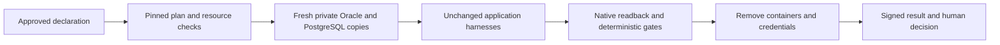

# MS87 — Unattended replay of native iDempiere journeys

Evidence recorded 26 September 2026, following MS86.

## Customer benefit

MS86 established useful native observations, but an operator ran the steps separately. MS87 makes those steps a declared, repeatable workflow: prepare fresh databases, execute both engines, capture observations, apply deterministic gates, clean up, and stop at the question reserved for a person.

Replay does not generate code. It uses the unchanged MS86 Java harnesses, deterministic planning and failure analysis, and a zero model-call budget. Its claim is unattended execution of a bounded experiment. Agent generation belongs to MS88.

## Declared experiment

The application remains iDempiere commit `731515dcdd5278b843db33b9d3109d155b881951`, on Oracle 26ai Free and PostgreSQL 15.19. Three fresh pairs run sequentially: fractional boundary values, the original `firstOnly()` locking diagnostic, and the bounded operational journey using the reviewed collection-query caller pattern.

The starting row multisets are checked across 913 common tables. Reviewed schema repairs and rollback-only constraint probes must leave those rows unchanged. Native catalogs, session settings, image identities, harness hashes, source identity, clocks, logs and raw row observations remain available to the verifier.

The business outcomes remain specific. Three units at a discounted actual price of 17.9955 produce net 53.99, fixture tax 4.05 and gross 58.04. The operational journey includes partial shipments, aggregate invoicing, payment, a 19.35 credit and its reversal, rollback/retry, and controlled row locking. This does not qualify all tax rules, concurrency, recovery or application behavior.

## Findings are reproduced, not erased

Oracle still loses the fractional shipment timestamp; PostgreSQL preserves it. Oracle therefore passes 14 of 15 boundary checks and PostgreSQL 15 of 15. Boundary equivalence stays false.

The original `Query.setForUpdate(true).firstOnly()` diagnostic still produces Oracle `ORA-03049` for `FOR UPDATE FETCH FIRST 2 ROWS ONLY`, while PostgreSQL completes. The comparison checks all three archived Oracle issue profiles, including the secondary closed-connection errors. Oracle truncates the primary issue stack before the harness frame, so its exact archived profile is checked independently of the secondary stacks' harness-call binding.

The operational caller pattern remains equivalent in its declared scope. It does not repair or qualify `firstOnly()`.

## Operational boundaries

Every run uses an internal-only Docker network, no published ports, fresh per-run credentials and fresh data. The existing isolated-compute policy remains `network_mode: none`; database lanes use a separate explicit policy. Maven runs offline from a prepared, pinned runner image. Dependency provisioning precedes the recorded run and is not represented as offline execution.

The declaration's exact hash is approved once. Plans bind implementation and input hashes and reject stale digests. Environmental retries are bounded. Harness exceptions, unexpected data and changed known findings cannot rewrite their own acceptance terms.

Cleanup runs on success, failure, cancellation, timeout and decision halt. Failure data is retained separately. A stopped run cannot be called complete when cleanup is incomplete. Abrupt worker death is handled by a detached watchdog. Resume binds the parent's signed observations and reruns only affected cases; a resume of an inherited run requires a fresh full replay.

## The question for the operator

The first successful replay raises `accept-contract-equivalence` because the timestamp contract remains unmet. It cleans up before waiting. `retain-open-finding` acknowledges that the issue remains open for replay; it does not accept data loss or establish boundary equivalence. No such semantic decision was made by the agent.

Control Tower's iDempiere Run panel shows the verified journal, native execution exits, gate results, cleanup and intervention count. Work queue shows the signed request for the selected run. Decisions use the signed local CLI. Convergence receives terminal run-index records. Discovery remains a separately labelled static dependency reference.

## Declaration corrections and development failures

The supplied declaration is retained byte for byte as `work-order.supplied.json`. The executable declaration corrects two row-admission rule names against archived MS86 evidence: `fresh-unique-generated-UUID` and `exact-native-decimal-value`. Trace comparisons retain their own unchanged rule names. No harness, expected outcome or claim flag was regenerated.

Development failures remain failed. They exposed Docker Desktop's empty port-binding placeholders, Oracle's version-product name, large catalog limits, missing catalog lineage, and the truncated primary stack trace. Fixing a verifier and rechecking retained observations did not retroactively convert a failed signed run into an accepted replay. Fresh acceptance runs were required.

## Acceptance evidence

Two consecutive native replays of the same declaration and plan passed all six gates each:

| Host entry point | Run | Result |
|---|---|---|
| Windows | `journey-5c1edbbd4e954c2bbc2feea90e462d5a` | Six gates passed; timestamp decision open |
| Linux / WSL Ubuntu | `journey-cab8521ea79446b5bf6232392e4ae04a` | Six gates passed; timestamp decision open |

Both used Docker Desktop on the same laptop. This checks both operating-system entry points; it is not independent infrastructure replication. Each run recorded six native executions, fifty signed events, zero model calls, zero interventions outside designed stops and complete cleanup. The deterministic business projections match across replays. Both receipts report `known_findings_reproduced: true`, `bounded_operations_equivalence: true`, `unattended_run: true` and `error: null`.

The shared plan is `299d3e03573cfaa15fffb18ee7d5010141c1e8731f7fbd4f2aaed15a79a01e0f`; declaration is `0e6d2d6cb5703866867989deff5a2c870b2a535da21df6213fa50fafd517ebda`. Both terminal states are `halted-for-decision`. The timestamp question remains unanswered.

The [published evidence](../../calibration/idempiere-native-journeys/README.md) retains signed observations, raw differences, gate results and execution logs. Its content-addressed archive reconstructs every original evidence file byte for byte before recomputing the gates. The [operational guide](../../../factory/idempiere/ms86-journeys/README.md) covers prerequisites, authorization, replay, cancellation, recovery, decisions and offline verification.

The full regression suite ran 1,715 tests: 1,682 passed and 33 skipped. Subsequent focused tests cover builder invocation accounting and the final lossless publication encoding. Three real Docker worker fault tests exercised cancellation, timeout and a killed container, with complete resource cleanup. Those fault fixtures are lifecycle checks, not additional business journeys. Linux also passed the focused replay, view, builder, extension and publication tests.

## Limits

`application_equivalence`, `schema_equivalence`, `platform_qualification`, `independently_attested` and `bounded_boundary_equivalence` remain false. The local operator's signatures establish integrity and attribution within the reviewed key boundary; they are not third-party attestation. No GCP resources were started.

The milestone introduces a repeatable unattended replay. It does not claim that a model generated these already existing journeys.
