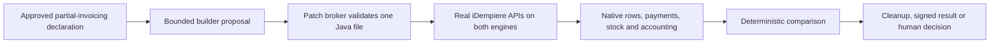

# MS88 — Agent-built partial invoicing, judged by native evidence

Following MS87, the user selected partial invoicing as the first bounded extension.

## Customer benefit

MS87 can repeat existing journeys without an operator assembling each step. MS88 asks a different question: can a builder generate a new journey within a declared boundary, and can deterministic gates establish what that journey actually did on both databases?

The builder creates one Java test class. It does not modify iDempiere production code, expected outcomes, the comparator or the gate. The controller applies the proposed edit through `PatchBroker`, then executes the generated harness against fresh local Oracle and PostgreSQL copies. Independent native readback determines the verdict.

## The declared business contract

A customer named `Café 東京 Łódź` orders three units. The list price is 19.995, the discount is 10%, the actual unit price is 17.9955 and the fixture tax rate is 7.5%. The optional description is empty on input and null after application save.

The first shipment and invoice cover one unit; the second cover two units. Each invoice is paid separately. The order's invoiced quantity must be one after the first invoice and three at completion. Opening stock ten must finish at seven.

| Document | Quantity | Net | Tax | Gross |
|---|---:|---:|---:|---:|
| First invoice | 1 | 18.00 | 1.35 | 19.35 |
| Second invoice | 2 | 35.99 | 2.70 | 38.69 |
| Total | 3 | 53.99 | 4.05 | 58.04 |

These are the declared expectations. The evidence below determines whether they were observed; expected values alone are never execution evidence.

## Generation boundary

The approved prompt contains the work order and MS86 reference Java APIs, with no database contents, credentials or gate output. The user explicitly approved sending that prepared source-code payload to Codex/OpenAI through the signed-in account.

Generation uses a tool-free, structured Codex builder turn. The builder's isolated workspace initially contains only a placeholder. It proposes an edit; the controller writes it. The boundary allows one file, at most 420 changed lines and 40,000 patch bytes, with at most five builder invocations, following explicit approval of each additional repair attempt and 900 seconds per invocation. Tool-operation events and out-of-scope edits are refused. The native environment has no external network route.

The receipt binds the exact prompt, proposal, event transcript, applied patch, generated harness and executable identity. A builder invocation is the accounting unit exposed by this transport; internal provider transport retries are not exposed. Generation provenance is separate from native execution evidence.

## Independent judgement

The native gate reads saved document headers and lines, quantities, decimal amounts, fixture tax, paid flags, allocations, warehouse movements and accounting balances. It checks customer and order links and requires exactly two invoices and two payments. The final quantities and balances come from database observations; intermediate quantity checkpoints are bound to the generated harness's committed trace.

Whole-state reconciliation retains every raw difference and permits only existing explicit rules. A simulated or unlabelled lane cannot acquire a native claim. A successful Java process alone cannot establish equivalence. A new unexplained difference remains a human decision.

The extension requires two admitted MS87 replays of the same current plan. It reuses their local lifecycle, isolated network, entry-state checks, resource ownership, cleanup and signed journal. It adds a separately bounded deterministic gate and records terminal history in Control Tower.

## Attempts and human authorization

The first client invocation used an incompatible older Codex CLI and produced no harness. It still consumed an invocation. The second generated a harness and ran it on Oracle, but an assertion compared `get_ValueAsString("Posted")` with the SQL string `Y`; the Java API returned `true`. That signed run remains failed, and PostgreSQL was not executed for it.

The user explicitly approved a third invocation and the revised source-code transfer. Repair guidance required the verified typed Boolean API and the declared trace fields. Business expectations and the independent gates were unchanged. The third harness uses `get_ValueAsBoolean("Posted")` before and after committing posted documents. The builder still cannot see gate output or edit its judge.

The third candidate corrected the Boolean assertion but introduced a compile error in `Doc.postImmediate`. Its signed run, `journey-71ac2046378c4ac6a181005752bba409`, remains failed. The Java business journey did not execute and PostgreSQL was not attempted. Cleanup completed and failure data was retained.

The user then approved a fourth invocation for one exact source replacement: `Doc.postImmediate` must receive `MAcctSchema.getClientAcctSchema(...)` as its first argument, as verified against the pinned application source. The builder received the prior candidate and the exact replacement. A hash guard requires the output to equal that single change byte for byte; any other edit is rejected before native execution. The expected repaired harness SHA-256 is `5ea40ccfd930f01d5d1464b0dccd37ef10e4f4d42383d16ffce51573cf835fc7`.

The fourth candidate matched its approved one-call repair exactly and completed on both Oracle and PostgreSQL. Independent per-lane readback confirmed the two paid invoices and twelve balanced accounting groups, but the whole-state gate rejected twenty new `T_Fact_Acct_History` rows on each engine. That signed run, `journey-c471ac0ea973422d8da460a19fa15a6a`, remains failed. A failed footprint check is recorded as `gate-failed`; it is not an approved normalization or a passing equivalence result.

The pinned iDempiere implementation explains the side effect: `Doc.postImmediate` asks `DocManager` to repost, which archives existing accounting entries before replacing them. The generated harness called it even when the completion workflow had already posted the document. No evidence rule or permitted-table list was broadened.

The user approved a fifth exact repair: call the posting method only when the typed `Posted` flag is false. The before/after commit assertions and all native gates remain unchanged. Its required harness SHA-256 is `4510cb8698b3f38098905e7e92578641daa3d7e8b3e7e191cd7176760a1975c4`. The same hash guard rejects every other source change before native execution.

[Selected signed failure receipts and diagnostic readbacks](../../calibration/idempiere-partial-invoicing/failed-attempts/summary.json) preserve that progression. Full failed-run journals and logs remain locally retained. The fourth attempt's per-lane readback pass must not be mistaken for an overall equivalence pass.

Client invocation accounting includes failed transports. Internal provider retries are not exposed. Per-generation token usage is labelled separately from cumulative invocation and completed-turn counts.

This history matters to the autonomy claim: the final declared run can be unattended, while the overall development sequence still included human-approved repairs and budget increases. The milestone does not claim that the first attempt succeeded without intervention.

## Native result and validation

The final run, `journey-be7ca0651d3c45a7bde77136a69006f1`, completed from 23:14:55 to 23:20:39 UTC on 26 September 2026. Its signed verdict is **`passed-bounded-partial-invoicing-equivalence`**. Both native Java processes exited zero, the unchanged independent gate passed, cleanup completed, and the final native run recorded zero interventions outside designed stops.

Each engine's readback verified two fully paid invoices with the declared quantities, net values, taxes and gross totals; opening stock ten and closing stock seven; twenty-eight accounting entries in twelve balanced groups; and no new application issues. The repaired harness left `T_Fact_Acct_History` unchanged. The complete comparison retained seventeen raw trace differences under the existing explicit rules and reported zero unresolved row differences.

The final receipt records `agent_generated: true`, `bounded_partial_invoicing_equivalence: true` and `unattended_extension: true`. Replay's separate `unattended_run` flag remains false for this extension mode. Five builder client invocations and four completed model turns are recorded. Final generation took 115.5 seconds and reported 21,353 input and 3,607 output tokens; that usage applies only to the fifth invocation.

The [published evidence and exact generated Java](../../calibration/idempiere-partial-invoicing/README.md) bind the builder transcript and proposal to the executed harness, observed states, signed journal and deterministic verdict. Offline verification reconstructs every original evidence file and recomputes the partial-invoicing and cleanup gates.

The full regression suite previously passed 1,682 tests with 33 skips. Sixteen focused tests subsequently passed for final builder accounting, exact-repair enforcement, evidence floors and lossless publication. The final milestone library is also checked with its standard verifier and documentation tests.

## Why the failed fourth attempt matters

An invoice-total-only comparator would have missed the redundant reposting: both engines produced the expected amounts and paid flags. The whole-state footprint gate rejected the extra accounting-history writes even though every Java assertion passed. That separates an observed business-path success from permission to accept all of its side effects.

The retained plans confirm that business expectations, the acceptance contract and the hashes of the partial-invoicing verifier, replay verifier and application-effects rules stayed unchanged from the first generated native attempt through the fifth. The builder was corrected to respect the declared boundary; the judge was not changed to accommodate its output.

## What this establishes

This is a bounded test of agent generation followed by deterministic native judgement. It does not demonstrate unrestricted autonomous SDLC, arbitrary application migration or agent repair of production code. The generated artifact is a new application test journey.

`application_equivalence`, `schema_equivalence`, `platform_qualification` and `independently_attested` remain false. The existing fractional timestamp loss remains unresolved and was not accepted by this milestone. Partial invoicing does not qualify every invoicing policy, tax jurisdiction, return, payment failure, concurrency pattern or recovery mode.

No GCP resources are used. Model generation uses the existing signed-in ChatGPT account; native execution uses local Docker.
