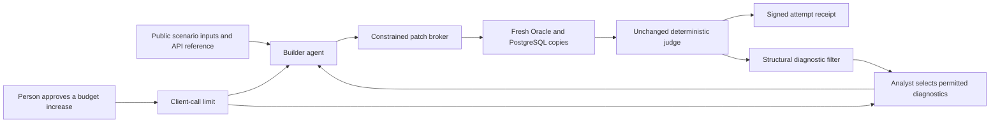

# MS89 — Analyst-led repairs with an unchanged native judge

## Purpose

MS88 established bounded native partial-invoicing equivalence, but people supplied its repair guidance. MS89 adds a constrained repair channel: the analyst reads permitted failure diagnostics, the builder changes its candidate, and the unchanged deterministic judge decides whether the next native attempt passes.

The user chose a fresh, independently generated partial-invoicing journey against the original MS88 judge. Reusing that judge makes the development process comparable. The new candidate is not copied from MS88's successful Java file.

## Separation of responsibilities



The builder receives input prices, quantities, tax configuration, required observations and API usage. Expected invoice values, expected stock results and private gate output do not enter its prompt. Every assertion is removed from the MS86 API example. The judge's expected values remain private to the deterministic native checks.

The diagnostic filter permits compile errors, API type mismatches and writes outside the declared footprint. It forwards structural fields, not arbitrary log text: a method name, visibility or types; a typed accessor with source-proven representation evidence; or an observed table plus a source-verified call path. The analyst must return a decision and closed reason code for every diagnostic. Only the selected diagnostic objects reach the builder. The analyst cannot add prose, an expected business value or a new admitting rule. An unsupported failure stops the campaign.

The retained MS88 failures classify into those three permitted categories. Its accounting-history write binds to `Doc.postImmediate → DocManager.postDocument → Doc.post → Doc.deleteAcct`. No footprint rule is broadened to accept it.

## What is pinned and published

The campaign plan pins the builder executable SHA-256 and version, not merely the name `codex`. Every client invocation checks them before launch. It also pins the original MS88 judge, public prompt/API inputs, implementation, database images and starting-state lineage. Local runtime checkpoints reject changed implementation bytes.

Every native attempt retains its full plan, candidate identity, judge hashes and signed terminal receipt. A failure before readback is still a failed attempt, not an executed passing gate. The [MS88 retrospective audit](../../calibration/idempiere-partial-invoicing/attempt-audit/receipt.json) exposes the original plans and proves that its three core gate modules, business expectations and acceptance contract stayed unchanged. The first failed client invocation never produced a native plan.

## Cost and human work

The campaign records every client invocation, including analyst calls and failed transports. It reports input, cached-input and output tokens; agent and native elapsed time; native failures; and the whole campaign's execution-segment elapsed time. Unknown usage remains unknown. Approval pauses between stopped segments are excluded and named explicitly. No per-call dollar bill is exposed by the signed-in account; local power is not metered, and no GCP resources are started.

The repair-byte metric covers candidate source and repair messages **after the initial pinned prompt**. It excludes creating the specification, controller, API examples and judge. A provenance audit checks that every executed candidate is exactly its signed model proposal, and that every repair prompt is exactly the initial prompt plus the previous candidate and selected diagnostics. Drift invalidates the metric rather than silently becoming zero.

The first MS89 execution segment stopped after four client calls and two native compile failures. The first repair removed one of two compiler errors. The analyst then declined the remaining diagnostic. Inspection found a defect in the filter: it collapsed a compiler visibility failure into a generic signature mismatch, omitting the useful permitted detail. The filter was corrected to preserve method visibility and parameter/argument types. This was a **human-authored controller improvement**, not a builder-source repair, and prevents claiming that the entire first development sequence was unattended. Its before/after implementation hashes and the original stopped receipt are retained in the resume proposal and history.

The user approved increasing the total budget from five to six client invocations for one further analyst-and-builder cycle. The initial builder prompt, candidate scenario and judge were not changed. Subsequent outcome evidence belongs in the signed campaign report, not in an inferred claim based on generation success.

That cycle identified a second compiler-feedback weakness: a method's declaring class was lost when the compiler reported it undefined on another class. The filter now preserves that distinction and resolves public method declarations automatically from hash-verified upstream source. It forwards the owning class and signature, not a human-authored code replacement. This second controller improvement is also explicitly retained; it must not disappear inside the zero candidate-repair-byte metric.

## Measured campaign result before the diagnostic recheck

The user approved a cumulative limit of ten calls. Campaign 01 stopped after nine, with status **`halted-nonrepairable`**. This status means the analyst selected no permitted repair diagnostic; it does not establish that the defect is impossible to repair. **No new verified journey was achieved.** MS88's earlier successful result remains separate.

The [signed campaign receipt](../../calibration/idempiere-analyst-repair/campaign-01/receipt.json) and [complete audit archive](../../calibration/idempiere-analyst-repair/campaign-01/campaign-audit.zip) preserve every attempt, agent call, prompt, candidate, structural diagnostic, judge hash and budget amendment. Offline verification reconstructed these artifacts and verified provenance and accounting. It did not replay a native business gate.

| Measurement | Recorded result |
|---|---|
| Calls | 9 of 10 authorized: 4 builder, 5 analyst |
| Tokens | 181,646 input; 19,688 output; 0 cached input |
| Failed client invocations | 0; usage reported for every call |
| Native attempts | 4, all failed on Oracle; PostgreSQL was not reached |
| Agent time | 653.891 seconds (10.9 minutes) |
| Native time | 1,134.404 seconds (18.9 minutes) |
| Total execution segments | 1,819.311 seconds (30.3 minutes), excluding stopped approval gaps |
| Human-authored candidate/repair-message bytes | 0, verified across all four candidates |
| Machine-forwarded diagnostic bytes | 929 |
| Human controller assistance | Two disclosed diagnostic-filter improvements |
| Dollar cost | Unavailable from the signed-in account; local energy unmetered; no GCP resources started |

| Native attempt | Result |
|---|---|
| `journey-d0743ad12f0441019a74a2148810c25f` | Compilation failed: missing posting/date APIs |
| `journey-c50406f11dd84b358036def00d4d2209` | Compilation failed: posting method not visible |
| `journey-0115e9a515964a838281ea051ae463ff` | Compilation failed: posting method called on the wrong class |
| `journey-db82574dea7b43eb86dc58c3d6aeb72d` | Compilation succeeded; Oracle execution failed at the candidate's posting precondition |

For the fourth attempt the filter emitted only a typed-API diagnostic: `Posted` was read through `PO.get_ValueAsString`, while the typed accessor is `PO.get_ValueAsBoolean`. The diagnostic carried the source hash and failing-method location. Expected/actual assertion values were withheld. The fifth analyst call returned an empty diagnostic selection, so the factory halted without invoking another builder. All four native attempts recorded complete cleanup.

This establishes traceable autonomous candidate repairs and a conservative stop boundary. It does **not** establish successful autonomous recovery end to end. The follow-up below retains this original stop and the unchanged judge.

## Diagnostic handoff fix and live recheck

The original analyst response contained only an empty identifier list. Its exact reason cannot be recovered. Inspection identified two concrete defects in the diagnostic contract: it asserted that `Posted` was Boolean without supplying the model's type evidence, and it labelled the failing assertion line 58 as the API call instead of distinguishing the accessor at line 53. The prompt also asked for an explanation of the entire failure, when a supported structural defect in the failing method is sufficient grounds for a bounded repair attempt.

The revised filter reads the generated model accessors from the already pinned upstream commit and publishes their source hashes. It checks the pinned `PO.java` implementation and supplies the String and Boolean accessor implementations. These establish that Boolean-backed fields and database `Y`/`N` text use different representations. No assertion's expected/actual value, financial result or database row is included. The diagnostic identifies both the accessor and failure locations and explicitly avoids claiming it proves the sole root cause.

The analyst now records one `forward`/`reject` decision per diagnostic. The closed reason codes are `supported-structural-defect`, `insufficient-type-evidence`, `unrelated-to-failing-method` and `outside-permitted-scope`. Missing decisions, duplicates, invented identifiers and additional prose are refused. Rejections remain permitted and auditable. Historical identifier-only selections remain verifiable in earlier archives.

The user requested this fix. An analyst-only recheck used **call 10, the one remaining call in the already approved budget**, and returned:

```json
{"decisions":[{"diagnostic_id":"diagnostic-1","disposition":"forward","reason":"supported-structural-defect"}]}
```

At that checkpoint the campaign status was **`repair-feedback-ready`**. The recheck consumed 21,998 input tokens, 81 output tokens and 8.359 agent seconds. Cumulative usage was 203,644 input tokens, 19,769 output tokens and 1,829.858 execution-segment seconds. All ten then-approved calls were consumed: four builder and six analyst calls. There remained four failed native attempts and zero new successful journeys. No builder, candidate edit or database run occurred during the recheck.

The [ten-call recheck audit](../../calibration/idempiere-analyst-repair/campaign-01-recheck/receipt.json) is a separate publication; the nine-call stopped audit above remains unchanged. Offline verification passed for both. This fix is the **third disclosed human-authored controller revision**, not candidate repair. The zero candidate-repair-byte measurement and original judge remain unchanged.

## Twenty-call authorization and paired native result

The user increased the cumulative limit to twenty calls. No controller, initial prompt or judge changes were made for this resume. Call 11 confirmed the structural diagnostic; builder call 12 changed the `Posted` checks and observations from the String accessor to the Boolean accessor. No human edited the candidate or supplied a candidate repair message.

Native attempt `journey-2ba2716e5c1749f89bdecd4cb1d17280` completed on **both Oracle and PostgreSQL**. Both processes exited zero and each independent lane receipt reported `passed-bounded-partial-invoicing-readback`: the two invoices, payments, stock and accounting checks passed. Each lane verified 28 accounting entries in 12 balanced groups. Entry and declared-footprint checks also passed.

The combined unchanged judge still returned **`partial-invoicing-review-required`**, with `bounded_partial_invoicing_equivalence: false`. Its unresolved findings were:

| Finding | Oracle | PostgreSQL | Scope |
|---|---|---|---|
| First and second shipment `shipdate` | `2026-09-26 12:34:56` | `2026-09-26 12:34:56.123456` | Two database rows and their two trace fields |
| `order.discount` trace | `10` | `10.00` | Additional numeric field outside the old comparator's numeric allowlist |
| `order.reserved` trace | `3` | `3.0` | Additional numeric field outside that allowlist |
| `shipment.delivered` trace | `3` | `3.0` | Additional numeric field outside that allowlist |

The two timestamp row findings and two timestamp trace findings describe the same two shipments; they are not four separate business defects. The named timestamp decision below accepts the demonstrated column's second-level precision, but does not rewrite the immutable MS88 comparison. Likewise, numerically equal additional trace fields are not silently admitted by a comparator that has no rule for them.

The structural filter found no permitted compile error, API type mismatch or write outside the declared footprint. It therefore stopped without an additional analyst or builder call. The campaign status is **`halted-nonrepairable`**, meaning this failure lies outside its current repair channel. It is not budget exhaustion: **12 of 20 calls were used; eight remain**. Cleanup completed and ephemeral credentials were destroyed.

The [paired-review audit](../../calibration/idempiere-analyst-repair/campaign-01-paired-review/receipt.json) preserves all twelve calls, five native attempts, per-lane readback summaries and the failed comparison. It verifies provenance and accounting without claiming to replay database observations. Native readback inputs remain retained locally. No successful native publication was manufactured from the failed combined verdict.

| Cumulative measurement | Recorded result |
|---|---|
| Calls | 12: 5 builder, 7 analyst |
| Input / output tokens | 248,122 / 24,044; all usage known |
| Native attempts | 5 failed combined attempts; the fifth completed both engines |
| Agent / native elapsed | 804.031 / 1,488.561 seconds |
| Total execution segments | 2,334.264 seconds (38.9 minutes), excluding stopped approval gaps |
| Human-authored candidate/repair-message bytes | 0, verified across all five candidates |
| Machine-forwarded diagnostic bytes | 5,624 |
| Controller revisions | 3, all disclosed; none during the twenty-call resume |

The demonstrated result is autonomous correction of the Boolean-accessor defect followed by successful business readback on both engines. Full paired equivalence remains false. Resolving the remaining findings requires an explicitly versioned comparison contract that applies the accepted timestamp scope and validates the extra numeric representations, while preserving this unchanged-judge result. It must not be presented as another hidden candidate repair.

## Timestamp decision

The user explicitly accepted second-level precision for the demonstrated Oracle `DATE` shipment column. The [named signed decision](../../../factory/idempiere/contracts/oracle-date-second-precision.json) is:

| Field | Value |
|---|---|
| Decision | `idempiere-oracle-date-seconds-v1` |
| Owner | Howard Weale |
| Scope | `adempiere.m_inout.shipdate` only |
| Precision | Whole seconds, with timezone and date/time components validated |
| Review date | 25 December 2026 |

Raw fractional values and the failed preservation probe remain evidence. The decision neither changes the original MS86–MS88 receipts nor approves every timestamp column. Changes to the datatype/application mapping or a need for subsecond ordering trigger review. Full schema, application and platform qualification remain unclaimed.

## Control Tower and verification

The Run view exposes the client pin, attempt judge hashes, campaign-wide costs and the current timestamp contract. The original journals retain their original status. Earlier failed attempts remain selectable. The decision's owner, scope and review date appear with it; after review becomes due, the view no longer presents the contract as currently effective.

Run instructions and the exact public prompt are in the [operator guide](../../../factory/idempiere/analyst-repair/README.md). Tests reject arbitrary analyst prose, invented diagnostics, business-value leakage through compiler logs, changed executable hashes, modified timestamp decisions and altered published judge hashes. These unit tests establish boundaries; only retained native observations establish a journey result.

## Builder input provenance

The initial prompt inherited the assertion-free MS86 example and public posting/API source informed by MS88. Later repairs came through the recorded structural diagnostic channel, including the `Posted` accessor correction selected at call 11 and generated at call 12. Compiler visibility, declaring-class and Boolean-evidence improvements were controller changes during development and remain disclosed. Initial-prompt knowledge and those controller changes are excluded from the zero candidate-repair-byte metric.
