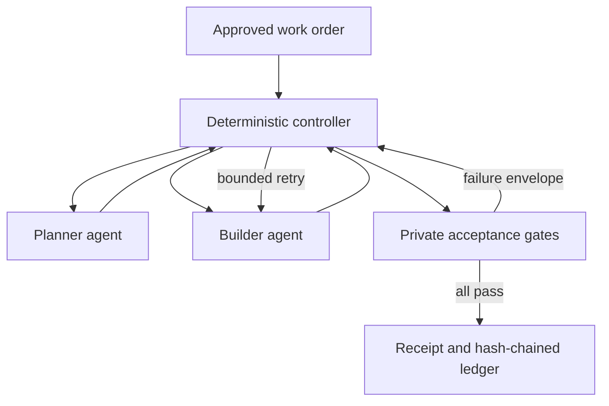

# LIGHTYEAR Autonomous Factory

The v0.7.1 factory is a bounded, evidence-governed run engine. It can plan, edit, verify, retry, and
record a modernization task without a person driving each step. It cannot declare itself correct:
only controller-run acceptance gates determine the final state.

## Control model



The roles are deliberately separate:

| Role | Receives | Produces | Cannot do |
|---|---|---|---|
| Planner | approved work order, bounded implementer graph | structured task plan | widen writable paths |
| Builder | plan, allowed files, public failure envelope | exact find/replace proposal | see private gate output or apply edits |
| Verifier | full controller gate report | private diagnosis | modify the workspace or declare acceptance |
| Controller | all signed-in-process artifacts and policy | state transitions, applied changes, receipt | waive a failed gate |

`LocalAgentSet` is a deterministic reference worker for the published mutation family.
`OpenAIAgentSet` is an optional Responses API adapter. The controller and artifact contracts remain
the same when the worker implementation changes.

## Run the mutation gauntlet

macOS or Linux:

```bash
./factory-benchmark.sh
```

Windows PowerShell:

```powershell
.\factory-benchmark.ps1
```

Five independent runs mutate rounding, annual-to-monthly conversion, default disclosure fallback,
zero-rate handling, and the final-account boundary. A successful benchmark means:

1. every mutated baseline was rejected by the private semantic gate;
2. the worker repaired the fault within the attempt and patch budgets;
3. the same private gate passed after repair; and
4. the benchmark observed zero false acceptances.

This proves the orchestration mechanics against synthetic faults. It is not evidence of arbitrary
coding ability and is not proof of z/OS equivalence.

On macOS and Linux, launchers select the first available supported interpreter from Python 3.14,
3.13, 3.12, 3.11, and `python3`. Apple's bundled Python 3.9 is rejected before run creation. Set
`LIGHTYEAR_PYTHON=/absolute/path/to/python` when an explicit interpreter is required.

## Run contract

The example at `work-orders/intcalc-repair.example.json` demonstrates the versioned work-order
contract. A work order fixes:

- exact writable project-relative paths;
- graph roots used to assemble implementer context;
- deterministic gate commands as argument arrays, never shell strings;
- baseline-first behavior and maximum attempts;
- file-count and patch-byte budgets;
- network intent and implementer audience; and
- goals and explicit non-goals.

Run it from the project root:

```bash
PYTHONPATH=src python3 -m lightyear_factory run \
  --work-order factory/work-orders/intcalc-repair.example.json \
  --source-root . \
  --runs-root work/factory-runs \
  --provider local
```

The checked-in candidate is already correct, so this example normally passes its baseline with
zero edits. Use `./factory-benchmark.sh` to observe the full failure-and-repair loop.

## Run artifacts

Each run has its own directory:

```text
work/<collection>/<run-id>/
├── work-order.json
├── events.jsonl
├── artifacts/
├── workspace/
├── receipt.json
└── summary.json
```

`events.jsonl` is append-only and hash chained. Every artifact and receipt has a canonical content
hash. Implementer views remove verifier-private artifacts and redact their event references. The
Factory tab in the graph explorer reads only these run artifacts; it does not become the authority
for the run.

The human-readable `run_id` belongs to the receipt and can repeat across independent benchmark
collections. A collision-safe `run_key` is derived from the run's location beneath the configured
store root and is the opaque API/UI address. No local path is exposed to the browser.

## Security boundaries

v0.7 fails closed on unsafe relative paths, unauthorized plan paths, ambiguous edits, excess file
or patch budgets, duplicate run IDs, gate timeouts, and controller errors. It also removes proxy
variables when a work order denies network access and never invokes a shell for gate commands.

Two boundaries are intentionally incomplete and appear on every receipt:

- copy-on-run isolation is not an operating-system sandbox; and
- network denial is advisory until a container, microVM, or policy engine enforces it.

The private benchmark module is separated from builder context by the controller, but it resides in
the same local checkout. Production use needs separate worker and verifier trust domains,
authenticated identities, signed work orders, secret brokering, immutable artifact storage, and
enforced egress policy.

## When the mainframe connection arrives

Keep the same run engine and add z/OS-backed gates rather than giving an agent unrestricted
mainframe access. A capture adapter should submit an approved job, record commit, JCL, input and
output dataset hashes, record counts, return codes, timestamps, environment identity, and redacted
logs. Differential observations then become verifier-private graph evidence. Only after those gates
pass should a receipt make a mainframe-equivalence claim.

Until that evidence exists, v0.7 receipts correctly say that runtime mainframe parity is unproven.
