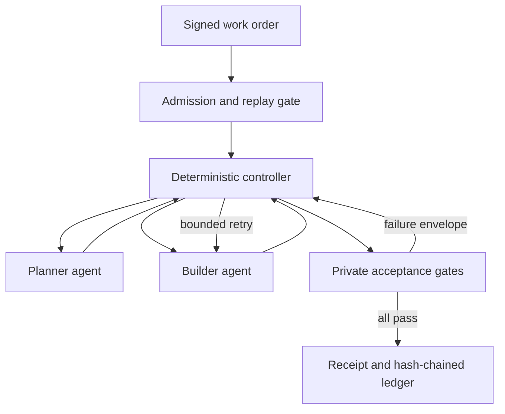

# LIGHTYEAR Autonomous Factory and Hardened Execution Plane

## Verifier invariant pinning (v0.18.5)

The normalization ledger is now an executable control rather than documentation alone. Its rule
ids, scopes, and behaviors must match the comparator in both directions; each rule requires an
owner, reason, and valid ISO review date; and verification fails on the review date until an
authorized review updates the ledger. Tests also pin the direct `GateContract` default to private
and the comparator's first-observed duplicate diagnostic policy. The clean-tree CI check is a
preventive control and is not evidence that an earlier tracked-artifact mutation was found.

## Verifier trust boundary (v0.18.4)

The factory treats a verifier that examined no evidence as unsafe, not successful. The INTCALC
differential comparator therefore has three outcomes: `passed`, `failed`, and `indeterminate`.
Both empty outputs return `indeterminate`; duplicate business keys and population-count mismatches
are explicit failures; and pinned timestamps are compared as business evidence. The only excluded
record field is declared copybook filler, with every normalization owned in
[`spec/comparison-normalizations.json`](../spec/comparison-normalizations.json).

Private gate output crosses into the builder context only when the corresponding work-order field
is the JSON boolean `true`. Strings such as `"false"`, numbers, missing values, and `null` cannot
open the boundary. `baseline_first` and `allow_network` use the same strict parsing rule. Run the
small adversarial suite before changing a verifier or factory contract:

```bash
./verifier-gauntlet.sh
```

```powershell
.\verifier-gauntlet.ps1
```

The gauntlet is a regression barrier, not proof that the comparator is complete. Every new proof
cell must add escape mutations for empty evidence, duplicates, omissions, reordering, truncation,
formatting, and incorrect normalization before it can support a promotion claim.

## CICS/VSAM, HLASM, and IMS vertical cells (v0.18.2)

The first online workload cell models `CAVW` transaction routing, BMS input/output, alternate-index
lookup, two primary keyed reads, NOTFND behavior, and a read-only invariant. Its builder surface is
bounded to `factory/benchmarks/cics_vsam_account_candidate.py`; an independent private gate rejects
routing, layout, key, and mutation faults. The production claim remains owned by the external
CICS/VSAM capture and signed equivalence gate under `readiness/cics-vsam/`.

The HLASM cell models the COBOL-callable `COBDATFT` routine, its `COCDATFT` parameter DSECT,
fixed-position compact/hyphenated date conversion, invalid direction handling, and the source's
commented separator validation. The bounded candidate is
`factory/benchmarks/asm_date_candidate.py`; the private policy is
`src/lightyear_factory/asm_private.py`. It is development-proven only: live assembly, link-edit,
COBOL caller execution, and an independently signed z/OS comparison remain blocked.

The IMS cell models the `CBPAUP0C` BMP purge across `PSBPAUTB`, `DBPAUTP0`, `PAUTSUM0`, and
`PAUTDTL1`. It preserves inverted Julian-date qualification, approved/declined summary
adjustments, GN/GNP/DLET ordering, strict checkpoint frequency, and the duplicated approved-count
root deletion test found in the source. The bounded candidate is
`factory/benchmarks/ims_expiry_candidate.py`; the private gate is
`src/lightyear_factory/ims_private.py`. Only a signed, authorized live BMP capture can advance it
from development proof to mainframe equivalence.

## Durable execution (v0.16)

The portfolio controller can now submit exact plans to a transactional queue. Disposable workers
use bounded leases and heartbeats; completion receipts are content-addressed; crashed leases are
recovered; exhausted items are dead-lettered; and later waves fail closed behind unsuccessful
predecessors. Human approvals are consumed once in the same database transaction as run creation.
Start with `./durable-factory.sh verify` and read
[`factory/durable/README.md`](durable/README.md).

The factory is a bounded, evidence-governed run engine. It can plan, edit, verify, retry, and
record a modernization task without a person driving each step. It cannot declare itself correct:
only controller-run acceptance gates determine the final state.

v0.11 adds enforceable admission and execution security around that loop. A signed work order is
verified against an external key, expiry, trusted issuer, exact policy hash, and one-use nonce.
Short-lived credentials authorize planner, builder, failure-analyst, provider, and verifier actions independently.
Acceptance gates can run through Docker or Podman with a digest-pinned image, no network, read-only
root and workspace filesystems, a non-root user, all capabilities dropped, no-new-privileges,
bounded processes, memory, CPU and tmpfs, and no shell interpolation.

v0.11.1 distinguishes policy simulation, a live runtime probe, and a signed admitted factory run.
Only the last class can satisfy hardened readiness. Its receipt binds admission, work order,
policy, issued identities, verified role actions, acceptance-gate executions, and protected-value
posture; the audit engine recomputes readiness instead of trusting a producer-supplied flag.

v0.11.2 maps host workspace environment values to the fixed `/workspace` OCI mount. This prevents
Mac or Windows host paths from reaching a Linux container and makes the private verifier portable
without weakening the read-only mount or exposing additional environment variables.

v0.12 adds the graph-grounded model work cell inside those boundaries. Model providers are
replaceable; the controller assembles approved graph and source context, enforces call/token/cost/
time budgets, mediates every patch, sanitizes verifier feedback, and records prompt-free call
evidence. The model proposes work but never receives write authority or acceptance authority.

v0.12.1 adds a resilient evaluation controller around that cell. Transient rate limits and
transport failures retry within a bounded, receipted policy; hard billing or quota failures stop
immediately. A checkpoint is written after every completed case, so an interrupted evaluation can
resume without paying to rerun completed cases. Evaluation-wide budgets constrain total calls,
tokens, and estimated cost in addition to the existing per-work-order limits.

v0.12.2 makes model context progressive. The planner sees graph structure, file identities, and
short source previews; its structured tasks select evidence capsule IDs. The controller validates
those IDs and retrieves only their complete excerpts for the builder. The full context remains a
content-addressed controller artifact for audit, but is no longer resent to every role. The live
OpenAI provider also counts exact input tokens before generation and fails closed above the
per-call ceiling.

v0.13 adds the independent quality boundary. Holdout catalogs are signed outside the repository,
admitted as expiring envelopes, addressed by opaque case references, and never copied into worker
artifacts. A versioned policy evaluates mutation repair, clean no-change behavior, evidence
selection, privacy, path safety, token efficiency, and cost. Only a verified sealed evaluation can
qualify; public calibration remains useful but non-promotional.

v0.14 adds verified semantic memory after the quality boundary. The controller can promote a
passed repair, a correct no-change result, or a verified failure into a content-addressed
experience. Each record binds the work order and run ledger to exact graph, evidence-pack, source
capsule, and path identities. Positive memories may expose bounded successful edit templates;
negative memories expose only fingerprints. Sealed-holdout runs are never admitted to implementer
memory, and any graph or evidence-pack change excludes stale records from retrieval.

```bash
./semantic-memory.sh validate
./semantic-memory.sh summary
./semantic-memory.sh query factory/work-orders/intcalc-repair.example.json
```

Memory remains advisory. It can make planning faster and cheaper, but it cannot waive fresh source
inspection, deterministic gates, execution security, or mainframe-equivalence policy.

## Control model



The roles are deliberately separate:

| Role | Receives | Produces | Cannot do |
|---|---|---|---|
| Planner | approved work order, compact graph and evidence catalog | task plan with selected evidence IDs | widen writable paths or read full source bodies |
| Builder | plan-selected source excerpts, allowed files, public failure envelope | exact find/replace proposal | see unselected or private evidence, or apply edits |
| Failure analyst | sanitized gate metadata | bounded failure diagnosis | see private gate output or modify files |
| Verifier | isolated workspace and private gates | deterministic gate report | modify the workspace or waive a failure |
| Controller | all signed-in-process artifacts and policy | state transitions, applied changes, receipt | waive a failed gate |

Every role receives a work-order-bound, action-scoped credential. Model-provider credentials are
leased to the controller-side provider adapter, not exposed to planner or builder prompt content.
Lease receipts record only the approved name, subject and hashes; values are one-use, cleared from
the lease after consumption, and never serialized.

`LocalAgentSet` is a deterministic reference worker for the published mutation family.
`OpenAIAgentSet` is an optional Responses API adapter. The controller and artifact contracts remain
the same when the worker implementation changes.

`ModelAgentSet` is the v0.12 provider-neutral worker. `OpenAIResponsesProvider` is the first live
provider and `ScriptedModelProvider` exists only for deterministic tests. The provider receives
strict role-specific schemas; its outputs still pass controller validation and the patch broker.

## Model work-cell evaluation

Validate the checked-in 36-fault public calibration catalog without a provider call:

```bash
./model-workcell.sh validate
```

Run it with a live model:

```bash
export OPENAI_API_KEY="..."
export LIGHTYEAR_FACTORY_MODEL="gpt-5.6-terra"
export LIGHTYEAR_MODEL_INPUT_USD_PER_MILLION="2.00"
export LIGHTYEAR_MODEL_OUTPUT_USD_PER_MILLION="12.00"
./model-workcell.sh evaluate
```

The default live policy allows at most 180 calls, 8 million total tokens, USD 15 estimated cost,
USD 2 and 400,000 tokens per case, one second of pacing between cases, four transient retries per
provider call, and 25,000 output tokens per call. Override these with
`LIGHTYEAR_EVALUATION_MAX_MODEL_CALLS`, `LIGHTYEAR_EVALUATION_MAX_TOKENS`,
`LIGHTYEAR_EVALUATION_MAX_COST_USD`, `LIGHTYEAR_EVALUATION_MAX_CASE_COST_USD`,
`LIGHTYEAR_EVALUATION_MAX_CASE_TOKENS`, `LIGHTYEAR_EVALUATION_PACE_SECONDS`,
`LIGHTYEAR_MODEL_MAX_RETRIES`, `LIGHTYEAR_MODEL_MAX_OUTPUT_TOKENS`, or
`LIGHTYEAR_MODEL_MAX_INPUT_TOKENS_PER_CALL`. Exact input preflight defaults to 60,000 tokens per
call and can be disabled only with `LIGHTYEAR_MODEL_TOKEN_PREFLIGHT=false` for compatible offline
endpoints that do not implement the count API.

If the run stops, preserve the output directory shown as `MODEL_EVALUATION` and resume it:

```bash
./model-workcell.sh resume work/model-evaluation-YYYYMMDDTHHMMSSZ
```

Render the ordered, controller-mediated role exchange for one run:

```bash
./model-workcell.sh transcript <runs-root> <run-id>
```

The default transcript shows planner and builder artifacts plus hashes and call metrics, while
verifier-private artifacts appear as redacted placeholders. An authorized diagnostic session can
add `--verifier` as the final argument.

`evaluation.checkpoint.json` is updated after each case. `evaluation.receipt.json` is always
written, including for a budget or provider stop, and contains only sanitized failure metadata.

The evaluation receipt reports baseline rejection, repair rate, false acceptance, attempts, calls,
tokens, estimated cost, and each factory receipt identity. Public cases calibrate mechanics and
model behavior; they do not prove blind generalization. A sealed holdout must be retained outside
the worker-visible repository and supplied as an external catalog. Neither class proves z/OS
equivalence. See `evals/README.md` for evidence-class and scoring rules.

For a sealed evaluation, the independent evaluator keeps the catalog outside the repository and
uses an external 32-byte-or-longer key:

```bash
export LIGHTYEAR_EVALUATION_SIGNING_KEY="$(openssl rand -hex 32)"
./quality-gate.sh sign /secure/holdout.json /secure/holdout.envelope.json independent-evaluator
./quality-gate.sh validate /secure/holdout.envelope.json
./quality-gate.sh evaluate /secure/holdout.envelope.json
./quality-gate.sh compare work/evaluation-a/evaluation.receipt.json work/evaluation-b/evaluation.receipt.json
```

The public receipt contains the envelope and catalog hashes, aggregate metrics, opaque case
references, and the quality decision. It does not contain case IDs, categories, mutation markers,
private gate output, or the signing key. The Quality tab displays this receipt but cannot alter it.

## Run the mutation gauntlet

macOS or Linux:

```bash
./factory-benchmark.sh
```

Windows PowerShell:

```powershell
.\factory-benchmark.ps1
```

Five independent runs mutate rounding, annual-to-monthly conversion, default disclosure fallback,
zero-rate handling, and the final-account boundary. A successful benchmark means:

1. every mutated baseline was rejected by the private semantic gate;
2. the worker repaired the fault within the attempt and patch budgets;
3. the same private gate passed after repair; and
4. the benchmark observed zero false acceptances.

This proves the orchestration mechanics against synthetic faults. It is not evidence of arbitrary
coding ability and is not proof of z/OS equivalence.

On macOS and Linux, launchers select the first available supported interpreter from Python 3.14,
3.13, 3.12, 3.11, and `python3`. Apple's bundled Python 3.9 is rejected before run creation. Set
`LIGHTYEAR_PYTHON=/absolute/path/to/python` when an explicit interpreter is required.

## Run contract

The example at `work-orders/intcalc-repair.example.json` demonstrates the versioned work-order
contract. A work order fixes:

- exact writable project-relative paths;
- graph roots used to assemble implementer context;
- deterministic gate commands as argument arrays, never shell strings;
- baseline-first behavior and maximum attempts;
- file-count and patch-byte budgets;
- network intent and implementer audience; and
- goals and explicit non-goals.

Run it from the project root:

```bash
PYTHONPATH=src python3 -m lightyear_factory run \
  --work-order factory/work-orders/intcalc-repair.example.json \
  --source-root . \
  --runs-root work/factory-runs \
  --provider local
```

The checked-in candidate is already correct, so this example normally passes its baseline with
zero edits. Use `./factory-benchmark.sh` to observe the full failure-and-repair loop.

## Run artifacts

Each run has its own directory:

```text
work/<collection>/<run-id>/
├── work-order.json
├── events.jsonl
├── artifacts/
├── workspace/
├── receipt.json
└── summary.json
```

`events.jsonl` is append-only and hash chained. Every artifact and receipt has a canonical content
hash. Implementer views remove verifier-private artifacts and redact their event references. The
Factory tab in the graph explorer reads only these run artifacts; it does not become the authority
for the run.

The human-readable `run_id` belongs to the receipt and can repeat across independent benchmark
collections. A collision-safe `run_key` is derived from the run's location beneath the configured
store root and is the opaque API/UI address. No local path is exposed to the browser.

## Security boundaries

The factory fails closed on unsafe relative paths, unauthorized plan paths, ambiguous edits, excess file
or patch budgets, duplicate run IDs, gate timeouts, and controller errors. It also removes proxy
variables when a work order denies network access and never invokes a shell for gate commands.

The v0.11.2 hardened path additionally fails closed on invalid, expired, replayed or policy-mismatched
work-order signatures; wrong issuer keys; underlength signing keys; unauthorized agent actions;
cross-work-order credentials; unapproved protected-value names; missing container runtimes;
unpinned images; unapproved commands; and weakened isolation controls.

Build and verify the deterministic execution-policy conformance receipt:

```bash
./hardened-execution.sh build
./hardened-execution.sh verify
```

This proves contract and OCI invocation construction only. It deliberately reports `simulated` and
`production_ready: false`. To prove the live OCI boundary with Docker Desktop or Podman:

```bash
./hardened-execution.sh probe docker
```

The probe reports `runtime_ready: true` when isolation succeeds but remains
`production_ready: false` because it has no signed work order or agent-action evidence.

To admit and run the example work order, validate its composite evidence, and generate a live audit
snapshot plus dossier, keep both keys outside the repository:

```bash
export LIGHTYEAR_WORK_ORDER_SIGNING_KEY="$(openssl rand -hex 32)"
export LIGHTYEAR_IDENTITY_SIGNING_KEY="$(openssl rand -hex 32)"
./hardened-execution.sh admitted-run docker
```

An optional third argument supplies a run ID. Outputs are written under
`work/factory-runs/<run-id>/` and `work/hardened-execution-runs/<run-id>/`. The latter contains the
signed envelope, live audit snapshot, and release dossier; signing keys remain environment-only.

The compatibility path remains available for the offline mutation benchmark, but its receipts say
`advisory` and are not production-ready. A conformance simulator cannot become acceptance proof.

Remaining deployment boundaries include:

- HMAC is shared-secret admission; high-assurance deployments should use KMS-backed asymmetric
  signatures and independently authenticated human/service identity;
- Docker or Podman isolation inherits the security and configuration of its host daemon;
- output artifacts and nonce ledgers still need immutable external storage and concurrency control;
- egress allowlists are intentionally unsupported in v0.11.2—gate networking is either denied or the
  hardened policy does not admit the run.

The private benchmark module is separated from builder context by the controller, but it resides in
the same source snapshot mounted read-only during a hardened gate. Production use should also place
workers, verifiers, signing services and artifact retention in separate trust domains.

## Portfolio orchestration (v0.15)

`factory/portfolio/carddemo-portfolio.json` coordinates three bounded work cells. The controller
loads and hashes each work order, verifies every graph root, detects collisions and dependencies,
and emits deterministic waves. It does not ask a model to schedule work or decide risk.

```bash
./portfolio-factory.sh plan
./portfolio-factory.sh verify
```

POSTTRAN is deliberately marked high risk. Dispatch therefore requires a short-lived signature
from a named human that is bound to the exact plan hash:

```bash
export LIGHTYEAR_PORTFOLIO_APPROVAL_KEY="$(openssl rand -hex 32)"
export LIGHTYEAR_PORTFOLIO_APPROVER="your-name"
./portfolio-factory.sh sign
./portfolio-factory.sh run
```

The controller runs independent cells in parallel only when they have no detected conflict and all
declared predecessors have passed. A failed cell blocks all later waves. Approval does not waive a
gate, change a result, or establish mainframe equivalence.

## When the mainframe connection arrives

Keep the same run engine and add z/OS-backed gates rather than giving an agent unrestricted
mainframe access. A capture adapter should submit an approved job, record commit, JCL, input and
output dataset hashes, record counts, return codes, timestamps, environment identity, and redacted
logs. Differential observations then become verifier-private graph evidence. Only after those gates
pass should a receipt make a mainframe-equivalence claim.

Until that evidence exists, receipts correctly say that runtime mainframe parity is unproven.
